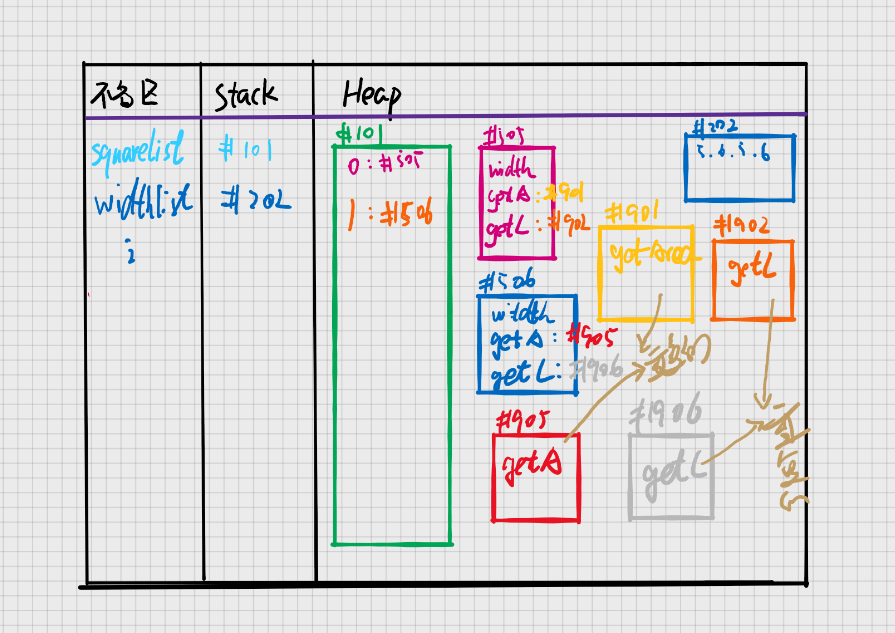

# JavaScript的对象分类
## 问题：对象需要分类吗？

**这是本次学习索要讨论的问题**

## 实现输出正方形的面积和周长

```javascript
const suqare = {
  width: 10,
  getArea() {
    return this.width * this.width;
  },
  getLength() {
    return this.width * 4;
  },
};
```

#### 1. 新需求：需要十个正方形

```javascript
const squareList = [];
for (let i = 0; i < 10; i++) {
  squareList[i] = {
    width: 10,
    getArea() {
      return this.width * this.width;
    },
    getLength() {
      return this.width * 4;
    },
  };
}
```

#### 2. 新需求：需要十个正方形，但是边长的大小分别为 5,6,5,6 间隔

```javascript
let squareList1 = [];
let widthList = [5, 6, 5, 6, 5, 6, 5, 6, 5, 6];
for (let i = 0; i < 10; i++) {
  squareList[i] = {
    width: widthList[i],
    getArea() {
      return this.width * this.width;
    },
    getLength() {
      return this.width * 4;
    },
  };
}
//看上去很完美，但是很浪费内存，如下是内存图
//getArea() 和 getLength() 重复创建了
```



#### 3. 改版一

```javascript
let squareList = [];
let widthList = [5, 6, 5, 6, 5, 6, 5, 6, 5, 6];
let squarePrototype = {
  getArea() {
    return this.width * this.width;
  },
  getLength() {
    return this.width * 4;
  },
};
for (let i = 0; i < 10; i++) {
  squareList[i] = Object.create(squarePrototype);
  squareList[i].width = widthList[i];
}
//大佬会讲，这种代码太分散了，怎么squarePrototype就是square的原型了
//抽离到函数
```

#### 4. 改版二

```javascript
let squareList = [];
let widthList = [5, 6, 5, 6, 5, 6, 5, 6, 5, 6];
function createSquare(width) {
  let obj = Object.create(squarePrototype);
  obj.width = width;
  return obj;
}
const squarePrototype = {
  getArea() {
    return this.width * this.width;
  },
  getLength() {
    return this.width * 4;
  },
};
for (let i = 0; i < 10; i++) {
  squareList[i] = createSquare(widthList[i]);
}
```

#### 5. 改版三

```javascript
// squarePrototype 原型和 createSquare函数还是分散的
let widthList = [5, 6, 5, 6, 5, 6, 5, 6, 5, 6];
function createSquare(width) {
  let obj = Object.create(squarePrototype);
  obj.width = width;
  return obj;
}
//直接上原型放到函数上
createSquare.squarePrototype = {
  getArea() {
    return this.width * this.width;
  },
  getLength() {
    return this.width * 4;
  },
  //方便通过原型找到构造函数
  constructor: createSquare,
};
for (let i = 0; i < 10; i++) {
  squareList[i] = createSquare(widthList[i]);
}
```

## 构造函数

上面这一坨演变的过程，最后固定下来，形成了 new 操作符

函数和原型结合

```javascript
let squareList = [];
let widthList = [5, 6, 5, 6, 5, 6, 5, 6, 5, 6];
function Square(width) {
  this.width = width;
}
Square.prototype.getArea = function () {
  return this.width * this.width;
};
Square.prototype.getLength = function () {
  return this.width * 4;
};
for (let i = 0; i < 10; i++) {
  squareList[i] = new Square(widthList[i]);
}
```

- **每个函数都有 prototype 属性**
- **每个 prototype 都有 constructor 属性**

## 总结

- new 做了以下四件事
  1. 自动创建空对象
  2. 自动为空对象创建原型，**原型的地址是 X.prototype**
  3. 自动将空对象作为 this 关键字运行构造函数
  4. 自动 return this

* 构造函数本身负责给对象本身添加属性
* X.prototype 负责保存对象的共有属性

## 使用 class

```javascript
let squareList = [];
let widthList = [5, 6, 5, 6, 5, 6, 5, 6, 5, 6];
class Square {
  constructor(width) {
    this.width = width;
  }
  getArea() {
    return this.width * this.width;
  }
}
```
## 对象为什么要分类
1. 有很多对象拥有一样的属性和行为，需要把他们分为一类
2. 还有很多对象拥有其他的行为，因此需要分不同的类
