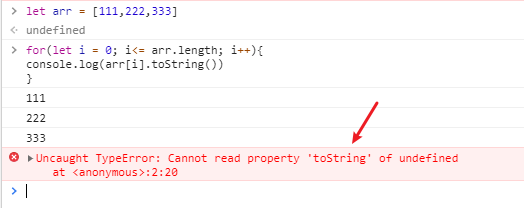

# avaScript特殊对象-数组

**在 JavaScript 中，没有真正的数组**

## JavaScript 的数组不是典型的数组

1. 典型的数组
   1. 元素的数据类型相同
   2. 使用连续的内存存储
   3. 通过数字下标获取元素
2. JavaScript 的数组
   1. 元素的类型可以不同
   2. 内存也不一定是连续的
   3. **不能通过数字下标来获取元素，是通过字符串下标获取**

## 创建数组

```JavaScript
    let arr = [1,2,3]
    let arr1 = new Array(1,2,3)
    let arr2 = new Array(3)
```

#### 通过字符串创建数组

```JavaScript
    let str ='1,2,3,4'
    let arr = str.split(',')
```

#### Array.from()

```JavaScript
    Array.from('123')
    //[1,2,3]
    Array.from({1:'a',2:'b",3:'c',length:4})
    //[1,2,3,4]
```

#### 伪数组

**伪数组的原型链中并没有数组的原型**

```javascript
let arr = [1, 2, 3, 4];
let arr1 = { 1: "a", 2: "b", 3: "c", length: 3 };
```

#### 合并两个数组得到新的数组(concat)

```JavaScript
    let arr1 = [1,2,3]
    let arr2 = [4,5,6]
    let arr3 = arr1.concat(arr2)
```

#### 截取数组得到新的数组(slice)


- 截取数组的一部分，形成新的数组
- JS 里面只提供浅拷贝

```JavaScript
    let arr = [1,2,3,4,5]
    let arr1 = arr.slice(1) //[2,3,4,5]
    let arr2 = arr.slice(0) //[1,2,3,4,5]
    let arr3 = arr.slice() //[1,2,3,4,5]
```

## 删除数组元素

1. 跟对象一样

```JavaScript
    let arr = [1,2,3]
    delete arr[1]
    console.log(arr) //[1,empty,3]
    //但是数组并没有变
```

2. 修改数组的长度

```JavaScript
    let arr = [1,2,3]
    arr.length = 1
    console.log(arr) //[1]
    delete arr.length //删除不掉length
```

**以上是不推荐的方式**

推荐的方式

1. 删除头部的元素

```JavaScript
    let arr = [1,2,3,4,5]
    arr.shift() // 返回删除的元素
    console.log(arr) //[2,3,4,5]
```

2. 删除尾部的元素

```JavaScript
    let arr = [1,2,3,4,5]
    arr.pop() //返回删除的元素
    console.log(arr) //[1,2,3,4]
```

3. 删除中间的元素

#### splice() 重要的 API，能删除，能修改，能添加

```JavaScript
    let arr = [1,2,3,4,5,6,7,8]
    arr.splice(2,1) //[3]  arr=[1,2,4,5,6,7,8]
    arr.splice(2,4) //[4,5,6,7]  arr = [1,2,8]
    arr.splice(1,1,666,777)// [2] arr = [1,666,777,8]
```

## 查看数组

1. **forEach 是一道坎**
2. forEach 与 for 循环的区别
   1. for 循环里面可以使用 break 和 continue
   2. for 是一个关键字，forEach 是一个函数

```JavaScript
    const item = [1,2,3,4,5]
    const copy =[]
    item.forEach(function(item){
        copy.push(item)
    })
    //手写forEach函数
   function forEach(arr,fn){
        for(let i=0; i<arr.length; i++){
            fn(arr[i],i,array)
            }
        }
    let arr = [1,2,3,4,5]
    forEach(arr,function(x,y){
        console.log(`${y} : ${x}`)
    })
```

2. 查看单个属性

- arr[0]
- 索引越界
  - arr[arr.length] === undefined
  - arr[-1] === undefined
- 报错

  

1. 查找某个元素是否在数组里面

- arr.indexOf(item) // 存在返回索引，否则返回-1

4. 使用条件查找元素 : find()

find() 方法返回数组中满足提供的测试函数的**第一个元素的值**。否则返回 undefined

```JavaScript
    let arr = [11,22,33,44,55]
    let result = arr.find(function(item){
        return item % 22 ===0
    })
    console.log(result)
```

5.  使用条件查找元素的下标 ： findIndex()

findIndex()方法返回数组中满足提供的测试函数的**第一个元素的索引**。若没有找到对应元素则**返回-1**。

```JavaScript
    let arr = [11,22,33,44,55]
    let result = arr.findIndex(function(item){
        return item % 22 ===0
    })
    console.log(result)
```

## 添加数组元素

1. 在尾部添加元素

- arr.push(newItem) // 修改 arr ，返回**数组长度**

2. 在头部添加元素

- arr.unshift(newItem) // 修改 arr ，返回**数组长度**

3. 在数组中间添加元素

- arr.splice(index,0,'x','y') //在 index 处插入 x , y

## 修改数组元素

1. 数组翻转： arr.reverse()

```JavaScript
    //将字符串反转
    let str = 'vino'
    let result = str.split('').reverse().join()
    console.log(result)
```

2. **数组排序** arr.sort()

```JavaScript
    let arr = [22,33,11,23,54,56]
    let result = arr.sort(function(x,y){
        if(a>b){
            return 1
        }else if(a === b){
            return 0
        }else {
            return -1
        }
    })
    console.log(result)
    //可以简写成下面的形式;箭头函数
    arr.sort((x,y)=> x-y)
```

## 数组变换

1. map (n 变 n)

map() 方法创建一个新数组，其结果是该数组中的每个元素是调用一次提供的函数后的返回值。

```JavaScript
    let arr = [1,2,3,4,5]
    let result = arr.map((item) => item * item)
    console.log(result)
```

2. filter (n 变少)

filter() 方法创建一个新数组, 其包含通过所提供函数实现的测试的所有元素。

```JavaScript
    let arr = [1,2,3,42,12,45,11,22]
    let result = arr.filter((item) => item < 22)
    console.log(result)
```

3.  reduce (n 变 1)

reduce() 方法对数组中的每个元素执行一个由您提供的 reducer 函数(升序执行)，将其结果汇总为单个返回值。

```JavaSCript
    let arr = [1,2,3,4,5]
    let sum = arr.reduce((sum,item) => sum +item,0)
    console.log(sum)
```

用 reduce 实现数组每个元素的平方

```JavaScript
    let arr = [1,2,3,4,5]
    let result = arr.reduce((arr1,item) =>{
        arr1.push(item *item)
            return  arr1
        },[])
    console.log(result)
```

用 reduce 实现查找所有偶数的元素，组成新数组

```JavaScript
    let arr = [1,2,3,4,5,6]
    let result = arr.reduce((arr1,item) =>
        // item % 2 ===1 ? arr1.concat([]): arr1.concat(item)
        arr1.concat((item % 2 ===1 ? []:item))
    ,[])
    console.log(result)
```

## 面试题

```JavaScript
     let arr = [
            {名称:'动物',id:1,parent:null},
            {名称:'狗',id:2,parent:1},
            {名称:'猫',id:3,parent:1},
        ]
        /**数组变成对象
        {
            id:1,
            名称:'动物',
            children:[
                {id:2,名称:'狗',children:null},
                {id:3,名称:'猫',children:null},
            ]
        }**/

        let result = arr.reduce((result,item) =>{
            if(item.parent === null){
                result['id'] = item.id
                result['名称'] = item['名称']
            }else {
                result['children'].push(item)
                delete item.parent
                item['children'] = null
            }
            return result
        },{id:null,children:[]})
        console.log(result)
```
