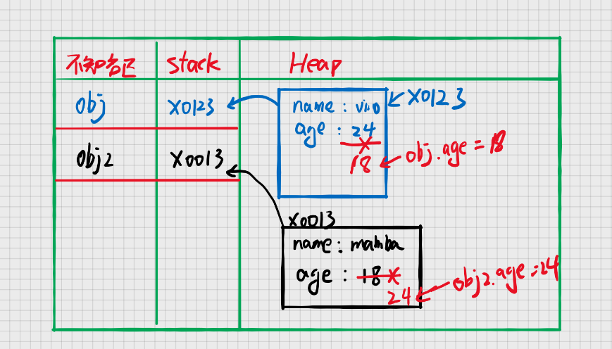

# JavaScript 的数据类型

到ES10为止，JavaScript目前有八种数据类型

* Null
* Undefined
* Boolean
* Number
* String
* Symbol
* BigInt
* Object

通常前面七种类型被称为**原始类型**，Object被称为**引用类型**

## 如何区分原始类型和引用类型

#### 1. 原始类型具有不可变性

之所以被定义为原始类型，因为他们代表的是原始值，代表着本身不可再被改变

```javascript
let string = 'vino'
string = string + 24
console.log(string) //"vino24"
```

上述代码看上去像是改变了`string`的值，其实不然。从内存的角度来理解，实际上是在栈中重新开辟了一块内存来存储“vino24”，再将变量`string`
指向这块内存。并非违反了原始数据的不可变性。具体解释请看下面的描述。

#### 内存被分为`Stack`和`Heap`

变量都需要用一个空间来存储，这个空间被划分成两种，分别是栈(Stack)内存和堆(Heap)内存

##### Stack

1. 空间较小，且固定
2. 由系统自动分配存储空间，可直接保存变量

因此我们将`string = 'vino'`存储在内存中如下图所示。当我们对`string`进行操作时，会将得到的结果存储在栈(Stack)内存中，然后将变量
`string`指向这个内存


正是由于栈空间大小是固定的，所以注定存储在栈里面的变量也是不可变的

#### 2. 引用类型是存储在堆(Heap)内存中的

##### Heap

1. 大小不固定，可以动态调整
2. 空间比较大，但运行效率较低
3. 通过引用的地址来读取

```javascript
const obj = {name: 'vino', age: 24}
obj.age = 18
const obj2 = {name: 'mamba', age: 18}
obj2.age = 24
```

上述代码对应的内存图如下



显而易见，引用类型是会被改变的，也就不具备不可变性

#### 3. 引用类型和原始类型的复制

对于原始类型，以`Stirng`为例，对于字符串的复制操作，会在栈内存开辟一个新的空间，并将值复制过去

```javascript
const str1 = 'vino'
const str2 = str1
```

上述代码，会开辟一个新的内存空间给变量`str2`，内存空间里面存放的值是从`str1`复制过来的

而对一个引用类型进行复制操作，会出现如下情况

```javascript
const obj1 = {name: 'vino', age: 24}
const obj2 = obj1
obj2.age = 18
console.log(obj1) // {name:'vino',age:18}
```

上述代码，将`obj1`复制给了`obj2`。通过前面的知识我们可以得到（想象以下内存图）复制操作只会将`obj1`的地址值复制给`obj2`。换句话说就是二者公用一个地址，也就说明指向了同一个内存空间，因此当改变`obj2.age`
的值会改变`obj1`也就不言而喻了。

#### 4. 引用类型和原始类型的比较

当两个原始类型进行比较时，拿字符串为例，当两个字符串进行对比

```javascript
const str1 = 'vino'
const str2 = 'vino'
console.log(str2 === str1) // true
```

上述代码显示 `str1` 与 `str2` 相等，想象一下内存图。在栈里面，`str1`对应内存空间的值与`str2`对应内存空间的值都是 `'vino'`,因此可以说两者是相等的。

再来看看引用类型的比较

```javascript
const obj1 = {name: 'vino', age: 24}
const obj2 = {name: 'vino', age: 24}
console.log(obj1 === obj2) // false
```

希望你不会对上述的结果感觉到疑惑，当你感觉疑惑的时候请尽量去想象内存图。虽然表面上看`obj1`的内容和`obj2`的内容相同，但是引用类型存储的是一个地址值，两块内存空间的地址是不一样的。所以结果为false

## 关于数据类型的几个小例子

```javascript
let str = 'vino'

function fn(str) {
    str = 'mamba'
}

fn(str)
console.log(str) //vino


let obj = {name: 'vino', age: 24}

function fn2(obj) {
    obj.name = 'mamba'
    obj = {name: 'kobe', age: 24}
}

fn2(obj)
console.log(obj) //{name: 'mamba', age: 24}
```


