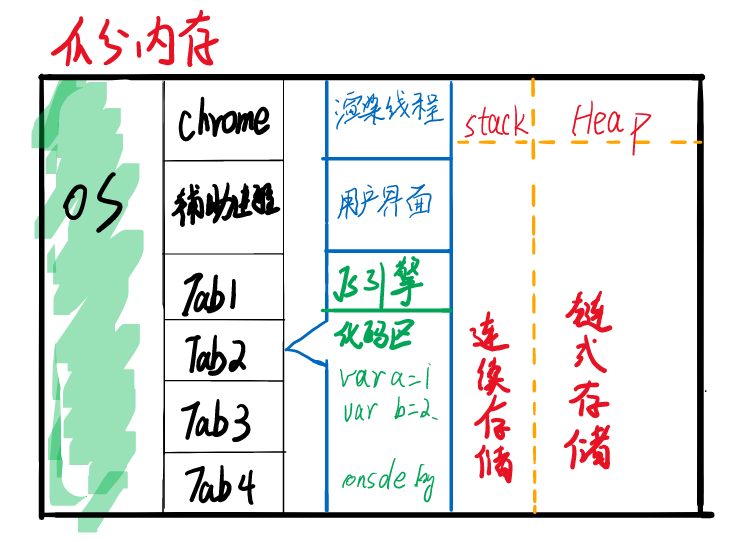
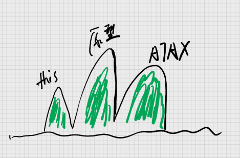
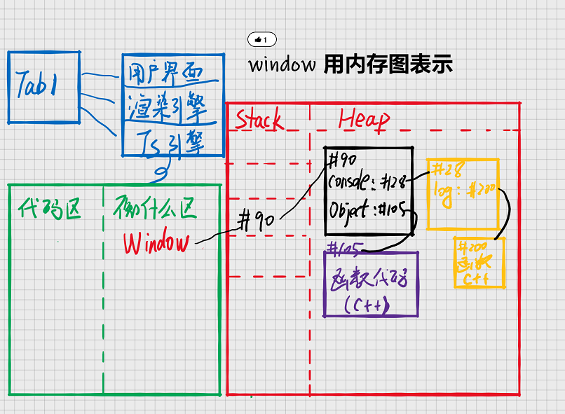
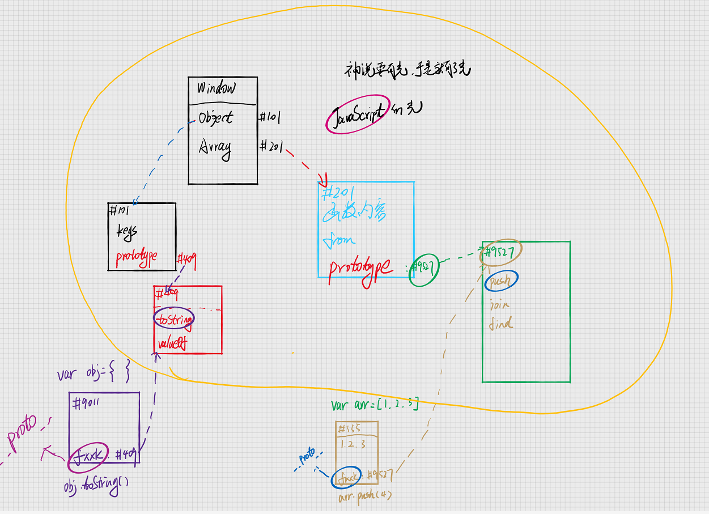
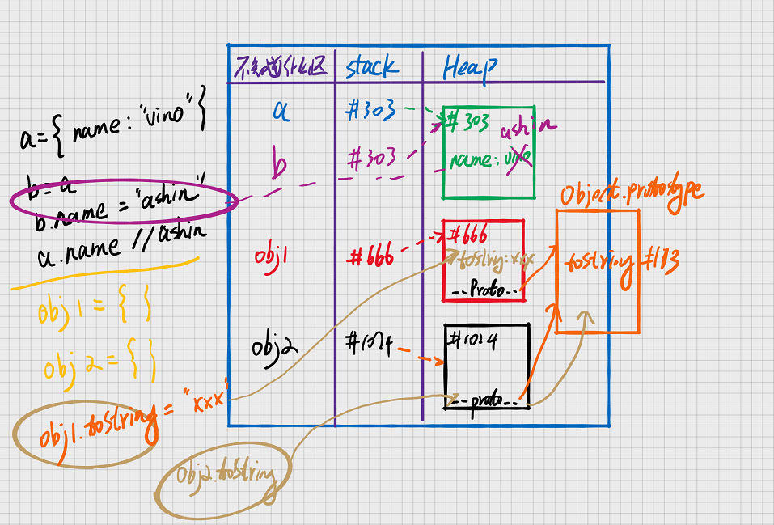
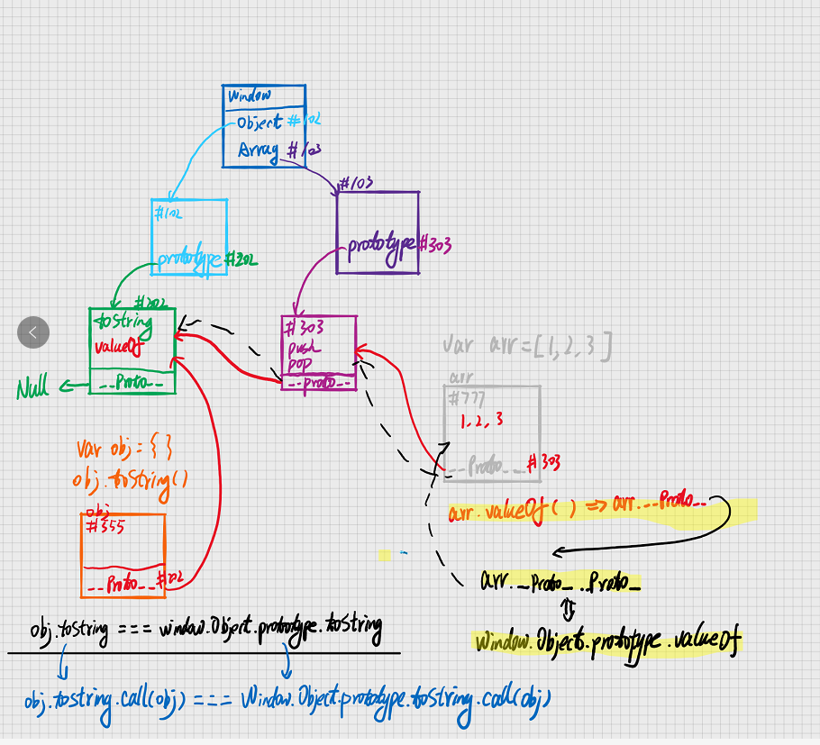

# 内存图与 JavaScript 世界

#### 打开浏览器

1. 双击浏览器，就会开始运行 Chrome.exe 文件
2. 开启 Chrome 进程作为**主进程**
3. 主进程会开启一些辅助进程， 如网络服务、GPU 加速
4. 你每新建一个网页，就可能会开启一个子进程

## 2. 浏览器的进程与线程

本章节内容参考: [浏览器的线程与进程](https://imweb.io/topic/58e3bfa845e5c13468f567d5)

### 1.进程与线程

要弄清进程与线程，需要了解下面一些概念

#### 1.CPU

计算机的核心是 CPU，他承担所有的计算任务。**单个 CPU 一次只能运行一个任务（进程）**，任意时刻，CPU 总是在运行一个进程，其他进程处于非运行状态。

#### 2.进程

进程是一个具有一定独立功能的程序在一个数据集上的一次动态执行的过程。是程序运行的载体。他代表 CPU 所能处理的单个任务

#### 3.线程

线程是程序执行当中一个单一的顺序控制流程，是程序执行流的最小单位。

#### 4.进程与线程的区别

- 进程是操作系统分配资源的最小单位，线城是程序执行流的最小单位
- 一个进程由一个或者多个线程组成，线程是一个进程中代码的不同执行路线
- **进程之间相互独立**，但是同一个进程下的线程之间，共享程序的内存空间
- 线程上下文切换要比进程快得多

### 2.浏览器的多进程架构

#### 1.浏览器的功能

- 发送**请求**，下载 HTML，解析 HTML，下载 CSS，解析 CSS，**渲染**界面，下载 JS，解析 JS，执行 JS 等。
- 功能模块：用户界面，**渲染引擎**，**JS 引擎**，存储等
- 上面的功能一般各处于不同的**线程**（如果进程是车间，那么线程就是流水线）

#### 2.JS 引擎

1. 编译：把 JS 代码翻译为机器能执行的字节码或者机器码
2. 优化：使其更高效
3. 执行：执行上面的字节码或者机器码
4. 垃圾回收：把 JS 用完的内存回收，方便之后再次使用

#### 3.浏览器多进程架构

与现在很多多线程浏览器不同的是，Chrome 浏览器使用多线程来隔离多个网页，即可以理解为，每开一个 tab 页面，就启动了一个进程。这么做得好处有：

1. 优化浏览器的健壮性：如果把所有网页都放在一个进程里面，当一个 tab 页面崩溃的时候，将会导致其他页面也一起崩溃，甚至浏览器崩溃
2. 进程之间是相互独立的，从而在一定程度上保证了网页的安全性能



3. stack 和 heap
4. stack 区：每个数据顺序存放
5. heap 区：每个数据随机存放

### 3.浏览器的内核

浏览器的内核是**多线程**，一个浏览器通常由以下线程组成：

1. GUI 渲染线程
2. js 引擎线程
3. 定时触发器线程
4. 事件触发线程
5. 异步 http 请求线程

#### 1.GUI 线程与 JS 线程互斥

JavaScript 可以操作 DOM，因此为了防止渲染出现不可预期的结果，浏览器设置 GUI 渲染线程与 JavaScript 殷勤**互斥**。当 JS 引擎线程运行时，GUI 线程会被挂起，GUI
线程更新的内容会被保存在一个队列当中。等线程空闲的时候再来执行。（这里就可以解释了为什么会出现页面阻塞的情况了）

#### 2.JS 阻塞页面加载

因为 GUI 线程与 JS 引擎线程的**互斥**的关系，所以如果当 JS 执行的时间过长，这样就会使得页面加载不连贯。

#### 3.JavaScript 是单线程的

JavaScript 为处理页面中用户的交互，以及操作 DOM 树、CSS 样式树来给用户呈现一份动态而丰富的交互体验和服务器逻辑的交互处理。如果 Javascript 是多线程的话，在多线程的交互下，处于 UI 中的 DOM
节点就可能成为一个临界资源，假设存在两个线程同时操作一个 DOM，一个负责修改一个负责删除，那么这个时候就需要浏览器来裁决如何生效哪个线程的执行结果。Javascript 在最初就选择了单线程执行。

## JavaScript 三座大山



## window 用内存图表示



## 3. 原型链

#### 1. 第一个例子

```javascript
var obj = {};
obj.toString(); //不报错
```

obj 并没有 toString 属性，为啥调用的时候并不会报错呢？



首先 obj 会在自己身上去找有没有 toString 属性，发现没有，于是到隐藏属性（`__`proto`__`）里面去查找。隐藏属性指向 Object 的 prototype 属性，在这里面发现了有 toString
属性，于是便可以执行。

#### 2. 第二个例子

```javascript
var obj1 = {};
var obj2 = {};
obj1.toString === obj2.toString; // true
obj1.toString = "fxxk";
obj2.toString; //还是原来的toString
```

这里为什么 obj2 的 toString 属性还是原来的呢？



- 一层可以修改
    - 所以上图中，当修改了 b.name 之后，a.name 也会改变
- 但是两层不能够修改（一般方法不可以修改）
    - **由于 toString 属性是在 Object 的 prototype 上面，obj1.toString=xxx，只会在 obj 上再设置一个 toString 属性，但是不会修改原型链上的 toString 属性**

#### 3. prototype 与 `__`proto`__`



- prototype 指向一块内存，这个内存里面有共用属性
- `__`proto`__` 指向同一块内存
- prototype 挂在函数上
- `__`proto`__` 挂在每个新生的对象上面
