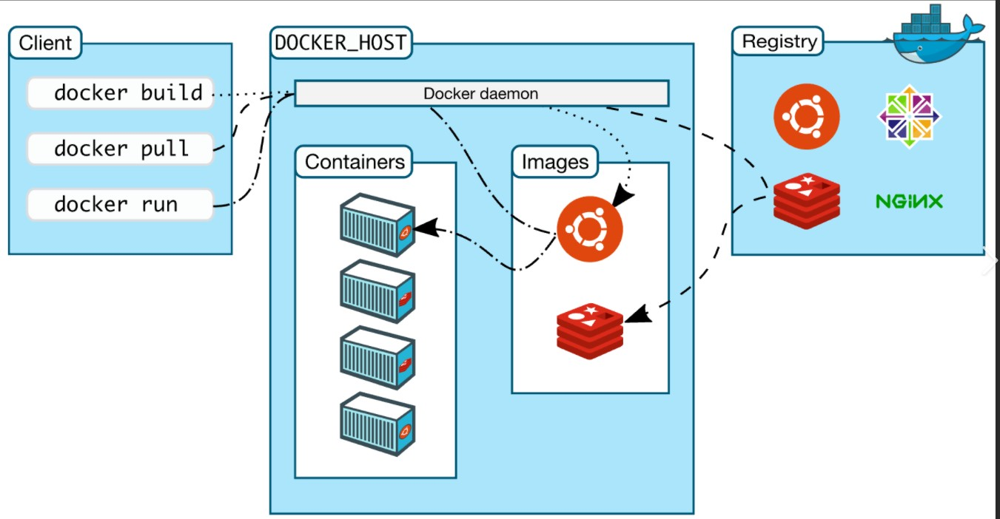

# docker 基础

## Docker 概述


基于`Go`语言开发，开源项目

Docker 的思想来自于集装箱，每个箱子是相互隔离的

通过制作镜像来部署

## Docker 安装



1. 镜像(image)

2. 容器(container)

3. 仓库(repository)


```shell
# 启动docker
systemctl start docker

# docker 默认工作路径
/var/lib/docker

# 查看镜像
docker images
```
## Docker 命令

####  帮助命令

```shell
docker info  # docker详细信息
docker --help
```
#### 镜像命令
```shell
# 查看所有镜像
docker images  # 详细 --help

# 查找dockerHub里面的镜像
docker search image-name

# 拉取镜像资源
docker pull image-name

# 删除镜像
docker rmi -f image-name/image-id
```

#### 容器命令

```shell
# 新建容器并启动
docker run [options] image

# 参数
# --name
# -d 后台运行 
# -it 使用交互方式运行
# -p 指定端口  -p 8080:8080

# 启动并进入容器
docker run -it centos /bin/bash

# 查看容器
docker ps -a 

# 删除容器
docker rm container-id

# 启动/停止容器
docker start container-id
docker restart container-id
docker stop container-id
docker kill container-id
```
#### 其他常用命令

1. 后台启动容器

```shell
docker run -d  image-name

# 容器后台运行，必须有一个前台进程。docker 发现没有应用就会自动停止

```

2. 查看日志
```shell
docker logs
```

3. 显示容器的信息

```shell
docker inspect id
```
4. 进入正在运行的容器

```shell
docker exec -it container-id /bin/bash
```
5. 从容器内部拷贝数据到容器外部

```shell
docker cp container-id:path : target-machine-path
```

## Docker 镜像

## Docker 数据卷

## DockerFile

## Docker 网络原理

## Docker Compose
