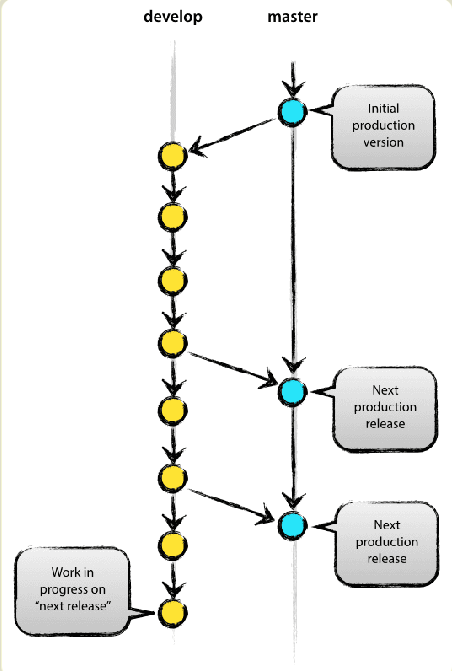

# Git 代码管理规范

> 1. 参考[阮一峰-Git分支管理策略](https://www.ruanyifeng.com/blog/2012/07/git.html)
> 2. 参考[阮一峰-Git工作流程](http://www.ruanyifeng.com/blog/2015/12/git-workflow.html)
> 3. 参考[阮一峰-常用Git命令清单](https://www.ruanyifeng.com/blog/2015/12/git-cheat-sheet.html)

## Git 工作流程

采用FDD功能驱动开发工作流程。 FDD(feature driven development)以需求为开发点。先有需求再有功能分支(feature),bug分支(hotfix)。完成开发后需要将分支合并到主分支(master)

### 1. 项目长期固定两个分支

|分支|介绍|
|---|---|
|主分支|master分支，代码库应有且只有一个主分支。用于构建生产环境，发布新版本。|
|开发分支|dev分支，开发环境的稳定分支。来源于master分支，之后便与master分支无关|



#### 主分支（master）

1. 代码库中有且只有一个主分支，用于版本发布。主分支名称一般命名`master`或者`main`
2. 主分支采用分支保护，仅管理员有权限。
3. 主分支用于发布版本，每次发布版本需要打tag。
4. 禁止将主分支(master)合并(merge)到其他分支。

```shell
# 相关操作示例代码
# 打标签
git tag -a v-1.0.1 -m "initial version"
# 推送tag到远程仓库
git push origin --tags
```

#### 开发分支（dev）

1. 开发环境的稳定分支，用于日常开发。
2. 开发分支(dev)来源于主分支(master)，只在创建的时候与主分支有关联。
3. 日常开发应该拉取dev分支的代码进行开发。

```shell
# 相关操作示例代码
# 远程仓库拉指定分支的代码
git clone -b dev [url]
```

### 2. 项目中三个短期分支

|分支|介绍|
|---|---|
|功能分支|feature分支用于开发某个特定功能，来自于开发分支(dev)，开发完成后需合并到开发分支(dev)|
|补丁分支|hotfix 分支用于修复线上的bug，fix 分支用于修复其他bug。二者都属于临时分支，合并完成后需及时删除分支 |
|预发布分支|release 分支一般用于预发布，场景如在合并到merge分支前，拉一个release分支用于测试|

#### 功能分支（feature）


1. 用于开发某种特定功能，来源于开发分支(dev)。开发完成后需合并到dev分支
2. 分支命名可采用：`feature-*`形式
3. 合并之后需删除该分支

```shell
# 创建feature分支并切换到该分支
git branch -b feature-1 dev
# git add.  git commit . ....
# 将开发功能合并到dev分支
git checkout  dev
# --no-ff 单独生成节点,有利于保持commit信息情绪，只要由合并都应该带上该参数
git merge --no-ff feature-1
# 删除feature分支
git branch -d feature-1
```

#### 补丁分支(hotfix/fix)


##### 1. 来自于线上的bug

* 从master分支对应的tag节点拉取修复bug分支(hotfix)
* fixed之后打包测试上线
* 完成后将分支合并到master和dev分支，并删除该分支

```shell
# 创建hotfix分支
git checkout -b hotfix-0.1 master
# git add  git commit ....
# 合并到master分支
git checkout master 
git merge --no-ff hotfix-0.1
git tag -a v-1.0.1 
# 合并到dev分支
git checkout dev 
git merge --no-ff hotfix-0.1

#删除hotfix 分支
git branch -d hotfix-0.1
```

##### 2. 来自于其他分支的bug

* 从该分支创建fix分支
* 修复完成后合并到该分支

#### 预发布分支（release）

* 在合并master分支之前，可能需要提取一个预发布的版本进行测试
* 来自于dev分支。预发布之后需要合并到dev分支和mater分支
* 分支命名可采用`release-*`形式

```shell
# 创建预发布分支
git checkout -b release-1.0.1 dev
# 合并到master分支
git checkout master 
git merge --no-ff release-1.0.1
git tag -a v-1.0.1 -m "version 1.0.1"

# 合并到dev 分支 
git checkout dev
git merge --no-ff release-1.0.1

# 删除release分支
git branch -d release-1.0.1
```

## 合并分支请求

根据公司开发流程的实际情况，在release版本后合并到master分支前，可以发起合并请求(PR)。并通知相关人员对代码进行 评审。在评审完成之后，合并代码到master分支，进行发布部署。

以云效为例


