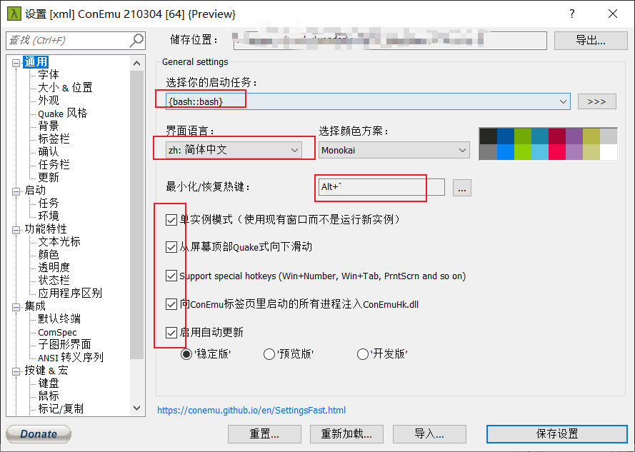
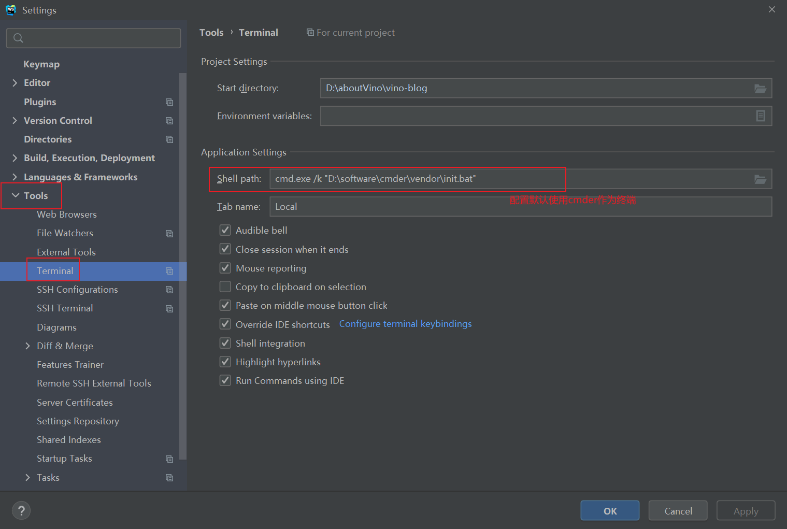
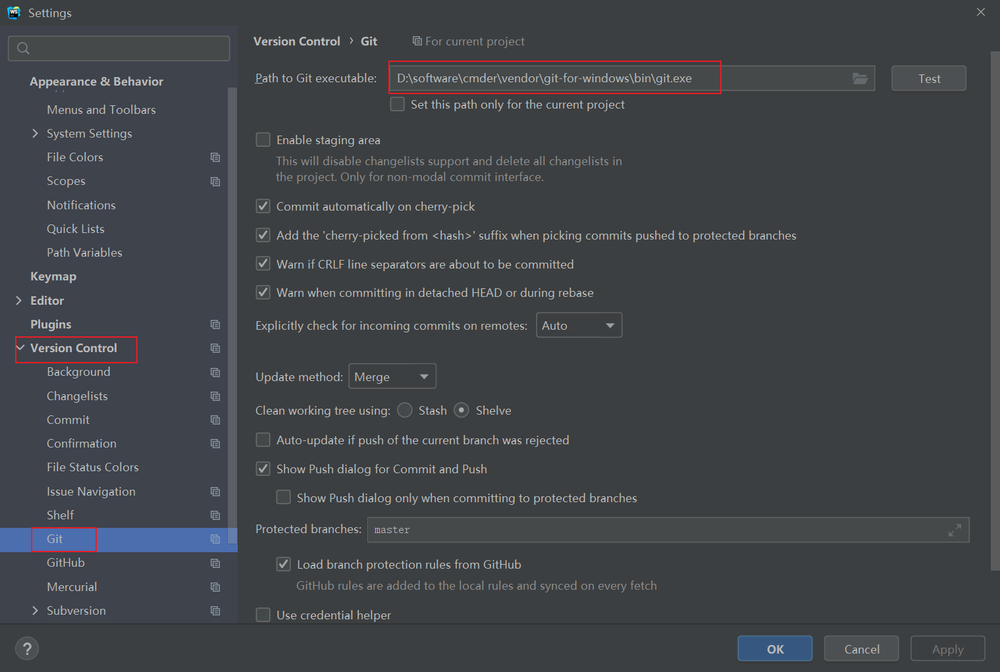
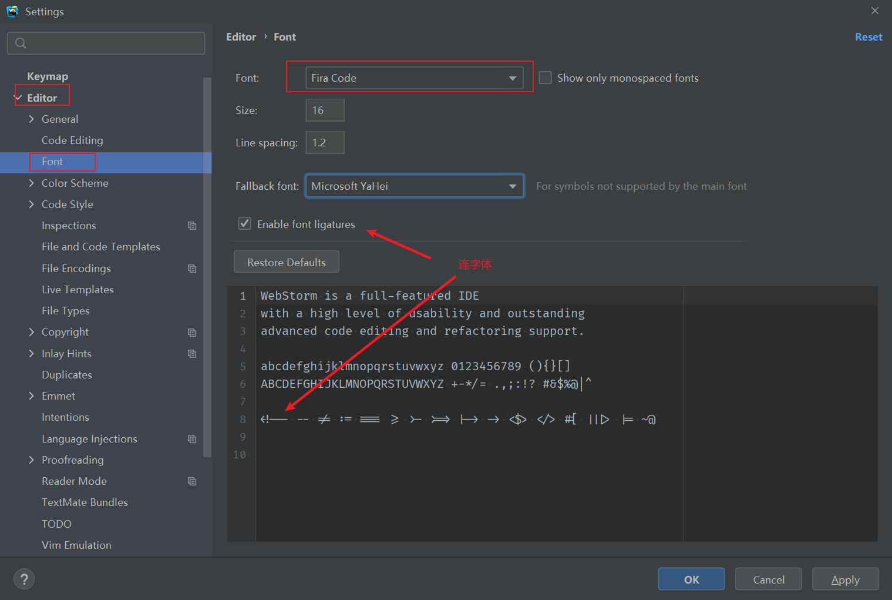
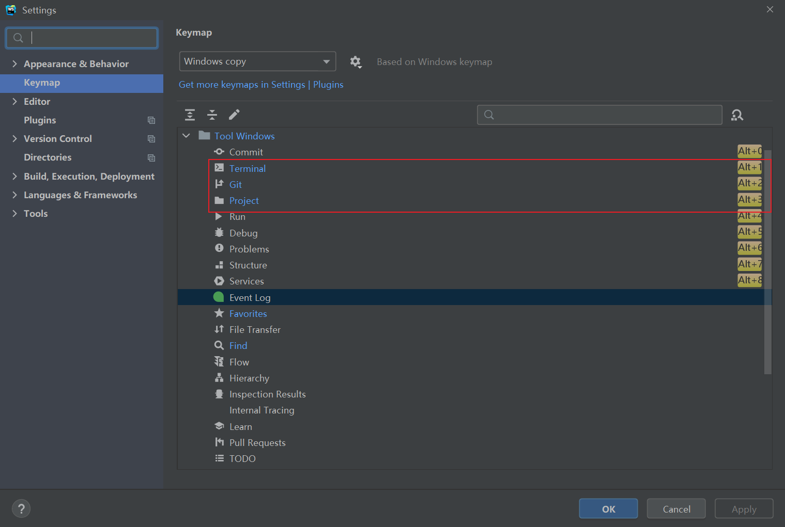

# 写给前端工程师的软件清单-windows

## uTools -- 你的生产力工具集

[下载链接](https://u.tools/)

## Listen1 -- One for all free music in China

[下载链接](http://listen1.github.io/listen1/)

## 7zip --压缩软件

[下载链接](https://www.7-zip.org/)

## snipaste --截图工具

[下载链接](https://zh.snipaste.com/download.html)

## cmder -- 代替gitBash

[下载链接](https://cmder.net/)
以下截图是进行的设置



## node.js

[下载链接](http://nodejs.cn/)

1. 安装nrm `npm install -g nrm` 方便快速切换淘宝源

2. 安装yarn 代替npm

3. 安装http-server

## 安装谷歌浏览器，火狐浏览器

## webstorm

[下载地址](https://www.jetbrains.com/zh-cn/)

[这个你一定会喜欢](https://zhile.io/2020/11/18/jetbrains-eval-reset-da33a93d.html)

1. 配置中端



2. 配置git



3. 配置字体



4. 配置快捷键，一般只会设置git，project和terminal



5. 如果你是一个vim coder(一般都不需要推荐) ,或者是想尝试vim的萌新,建议下载`ideaVim`插件,以下是我的快捷键配置，比较基础

```vim
" 禁用方向键
inoremap <Up> <Nop>
nnoremap <Up> <Nop>
inoremap <Down> <Nop>
nnoremap <Down> <Nop>
inoremap <Left> <Nop>
nnoremap <Left> <Nop>
inoremap <Right> <Nop>
nnoremap <Right> <Nop>
" 映射退出插入模式
inoremap jk <Esc>
inoremap <C-c> <Nop>
" 映射行首行尾
nnoremap H ^
nnoremap L $
" 显示当前模式
set showmode
" 共享系统粘贴板
set clipboard^=unnamed,unnamedplus
" 打开行号
set number
" 打开相对行号
set relativenumber
" 设置命令历史记录条数
set history=2000
" 关闭兼容vi
set nocompatible
" 开启语法高亮功能
syntax enable
" 允许用指定语法高亮配色方案替换默认方案
syntax on
" 模式搜索实时预览,增量搜索
set incsearch
" 设置搜索高亮
set hlsearch
" 忽略大小写 (该命令配合smartcase使用较好，否则不要开启)
set ignorecase
" 模式查找时智能忽略大小写
set smartcase
" vim自身命令行模式智能补全
set wildmenu
" 总是显示状态栏
set laststatus=2
" 显示光标当前位置
set ruler
" 高亮显示当前行/列
set cursorline
"set cursorcolumn
" 禁止折行
set nowrap
" 将制表符扩展为空格
set expandtab
" 设置编辑时制表符占用空格数
set tabstop=8
" 设置格式化时制表符占用空格数
set shiftwidth=4
" 让 vim 把连续数量的空格视为一个制表符
set softtabstop=4
" 基于缩进或语法进行代码折叠
set foldmethod=indent
set foldmethod=syntax
" 启动 vim 时关闭折叠代码
set nofoldenable
" 中英文切换
set keep-english-in-normal-and-restore-in-insert

```


