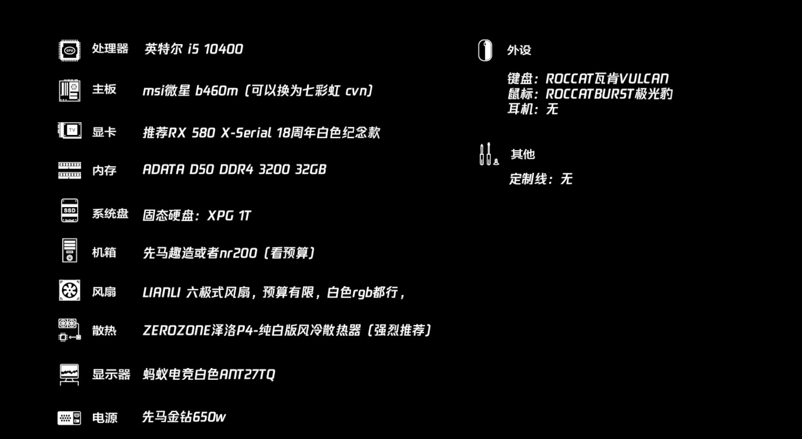

# 配置清单

- 处理器: Intel i5 10400

- 主板() [七彩虹cvn](https://item.jd.com/100010678679.html#crumb-wrap)  

- 显卡 RX 580 x-serial / RX5500xt 5700XT

- 内存(1299元) ADRTA D50 DDR4 3200 32GB     [链接](https://item.jd.com/100018137018.html#crumb-wrap)

- 电源 先马金钻650w

