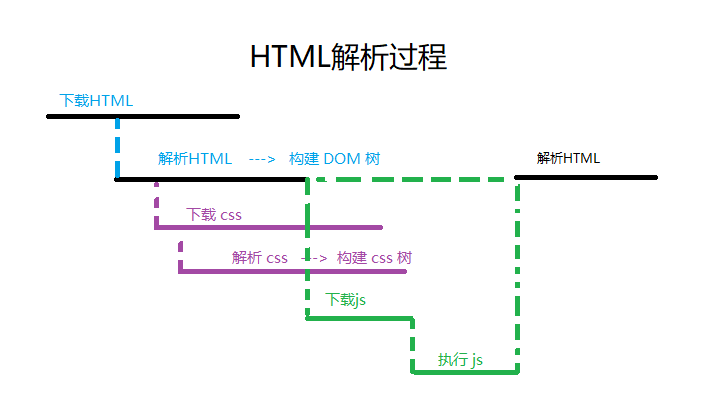
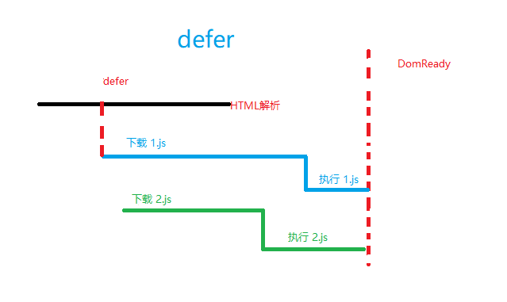
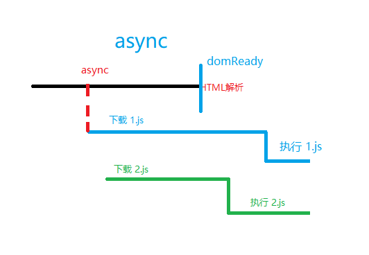
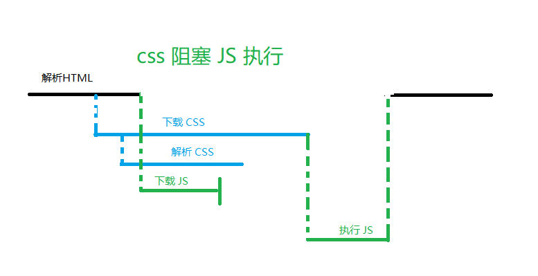
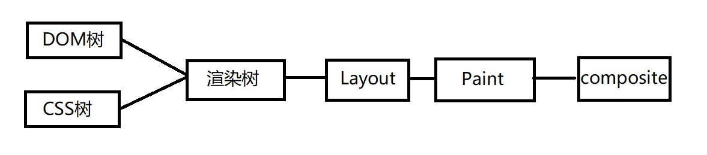

# 浏览器渲染原理

## HTML 解析与 JS 阻塞

HTML 的解析过程如下：

- 下载 HTML

- 解析 HTML 构建一个 DOM 树

- 下载 css

- 解析 css 构建一个 CSS 树

- 在解析 JavaScript 过程中会阻塞 HTML 的解析



### 下载/执行 js 为何会阻塞 HTML 的解析

- 执行 JS 的情况： 在**执行** JS 的时候可能会修改 **DOM** 树

- 下载 JS 的情况： 浏览器只有看到了 JS 请求的时候才会去下载 JS，下载之后就会去执行 JS

### async 和 defer 的区别

```html
<script async></script>
<script defer></script>
```

#### defer



#### async



defer 会在 domReady 事件之前完成 JS 的执行，而 async 的 JS 执行取决于 JS 是否下载完成。async 适用于不操作 dom 的 js 文件，一般使用比较少。

### JS 的执行被 CSS 阻塞



CSS 的下载和解析会阻塞 JS 的执行，因为 JS 的执行可能需要读取 CSS 的结果。(比如获取 div 的高度)

## 页面渲染

> DOM 树和 CSS 树会合成一个渲染树



- reflow 重新布局 (比如改变高度，宽度)

- repaint 重新绘制 (left 改成 transform，transform 之会重绘)
